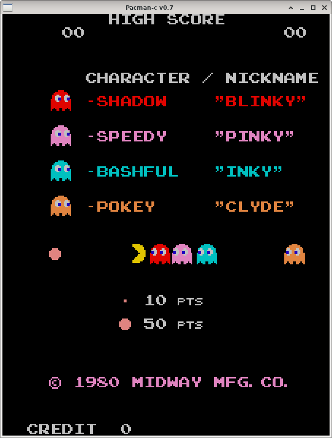
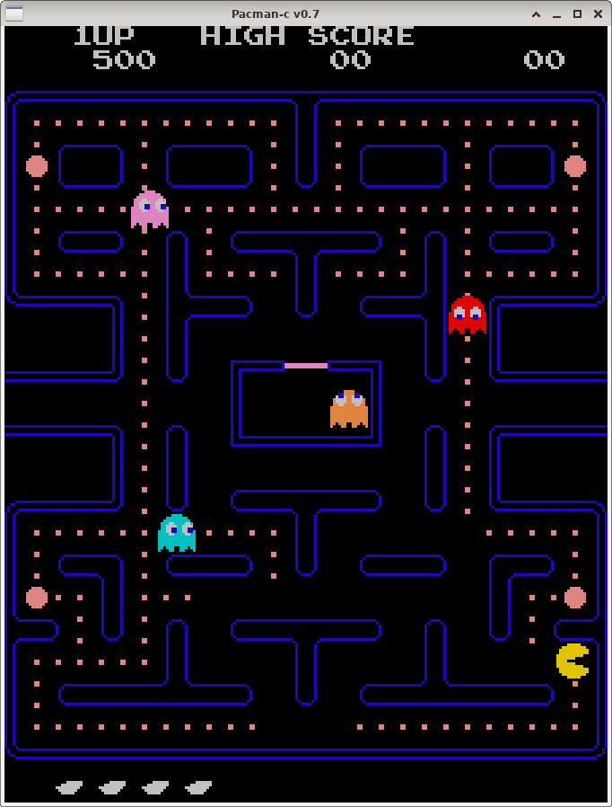
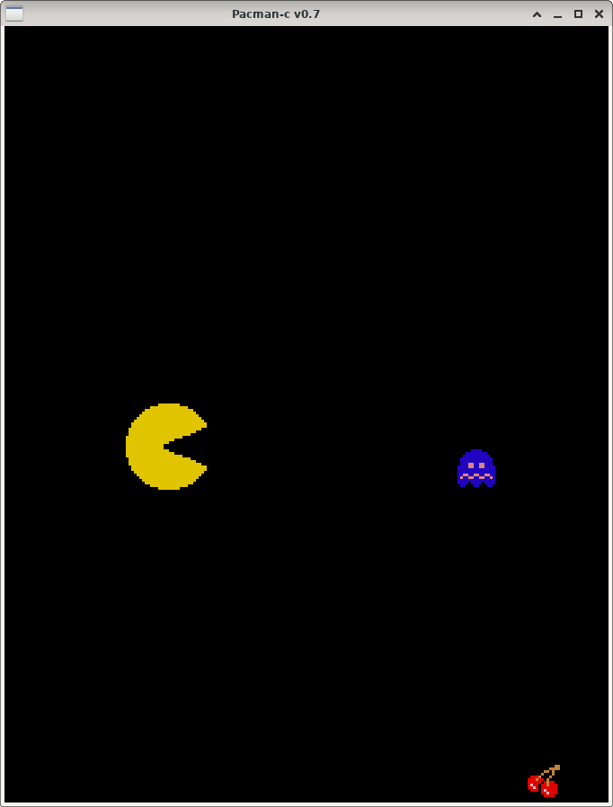
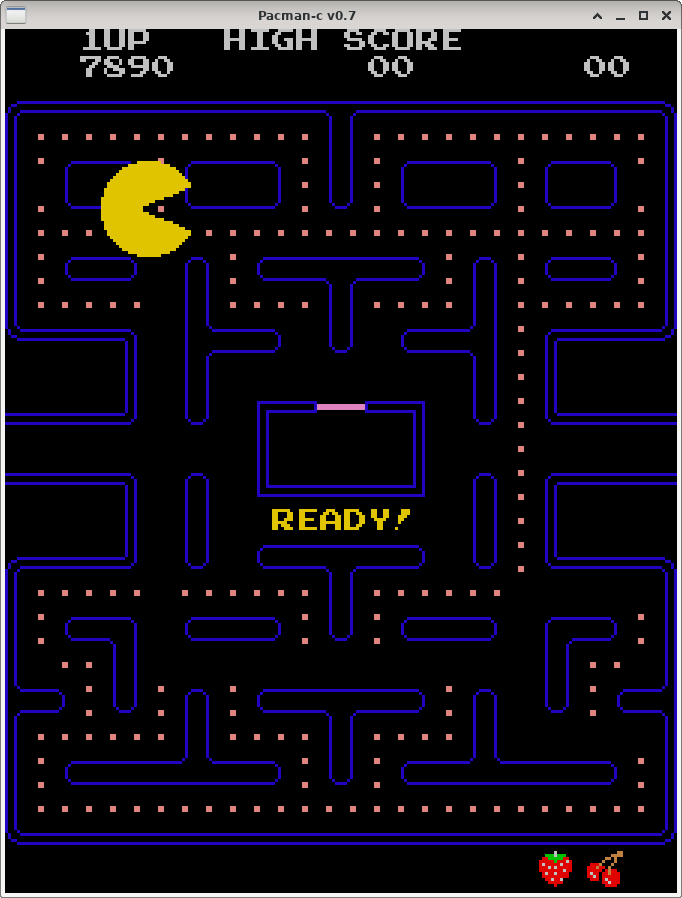

pacman in C
===========
This is a C translation of original pac-man ROM code.  Original code remains as
comments.  Assembly that has been translated is boxed off with //---- 

The main file is pacman.c.  Others are just support.

This project does not include original ROM files although they are required.
You will need to download them from somewhere else.  The code itself is a
derived work from the original (a translation).

build
=====
Builds under debian / ubuntu Linux.  Should build under other distros too but
hasn't been tested.  Uses the "glut" and "pulse[-simple]" libraries to provide video
using openGL and audio using pulseaudio.

Goals
=====
Create a full functional working version of pacman that behaves identically to
the original (patterns work as they would on mame, etc) but the code is compiled
C instead of emulated Z80.

Why?  To gain understanding of the original game mostly.  Being able to add
printfs has been very useful.  Also I can use gdb to examine and modify RAM
locations.

Notes
=====

In general, I have directly translated from the assembler even when it could be
done more efficiently with a new implementation.

The memory map is identical to the original.  Original ROMs are required for
code and bitmaps.  The original ROM code contains data structures for messages,
difficulty tables and so on.  It is also used to generate random numbers so
unfortunately needs to be included in full.  Convert the ROMs to header files
using xdd.

Functions are named followed by an underscore and their ROM address.  Data
structures similarly.  Functions that have a yet to be determined function are
just called func_xxxx().

The original ROM code uses lots of jumps to move around, often jumping into
another function.  I've changed these to function calls followed by return
wherever possible.  Some gotos still exist however where it would be too
convoluted to work around them.

When conforming to the original creates excessive code, I have created shortcut
C code.  For example a nested loop to fill 0x400 bytes of screen data may be a
single loop instead of two nested loops.

tablelookup and other support routines such as setMemory and fetchOffset are
often just replaced with an array index.

Tailcalls.  Many functions execute a jump to the tail end of another
function that updates a state or other operation.  In many cases I've just
inserted the action into the caller code instead of creating a function.

bugs
====

Still a few.  See bugs

Screenshots
===========

